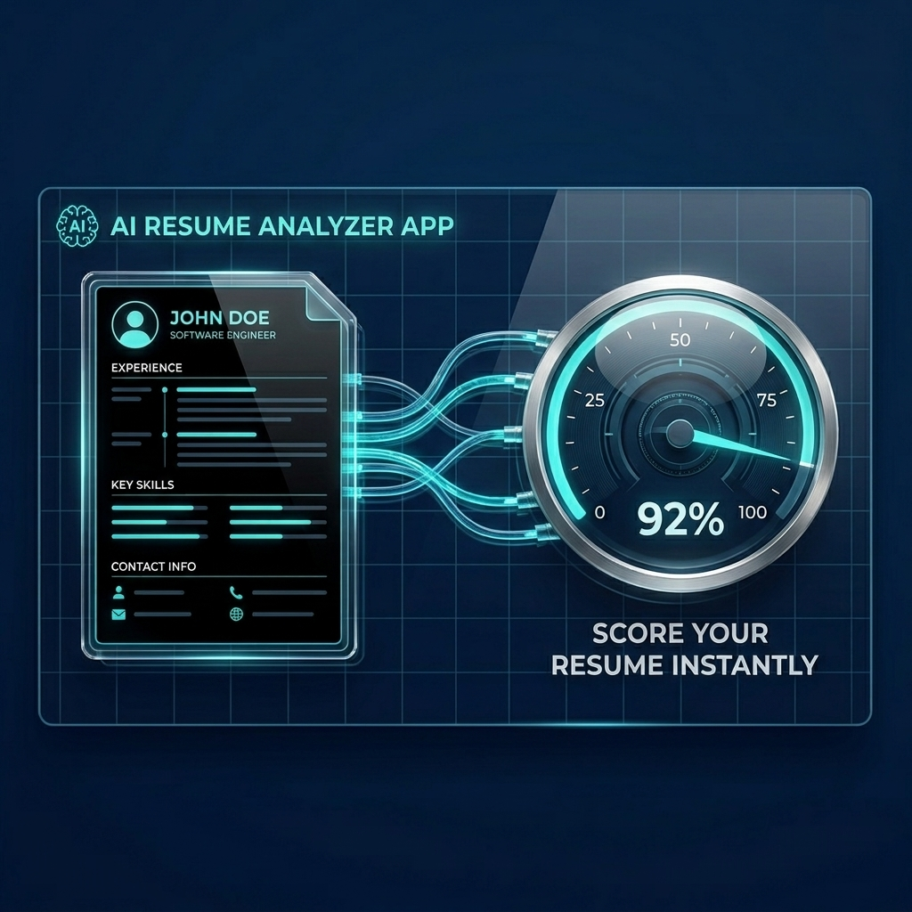

<div align="center">
  

  #  ResumeIQ AI

  **AI Resume Checker, ATS Scanner & Recruiter-Grade Resume Builder — powered by Google Gemini.**

  Upload a resume, get a full ATS score and category-by-category breakdown, then rebuild it with professional templates — all in one app.

  [](LICENSE)
  [](#-requirements)
  [](#-tech-stack)
  [](#-how-it-works)

</div>

---

##  Features

-  **Client login & signup** — email/password auth with OTP verification, plus guest/demo login
-  **Resume upload & parsing** — paste or upload resume text; a built-in parser extracts contact info, links, and sections automatically
-  **AI-powered analysis (Gemini)** — sends your resume + target role to the Gemini API and returns a structured report:
  - Overall score & letter grade (A+ to F)
  - ATS score with parsing risk and formatting/table/column/graphic warnings
  - Per-category evaluation: Contact Info, Summary, Skills, Experience, Projects, Education, Certifications, Formatting, Grammar, Keywords, Recruiter Readability
  - Red flags, career gap detection, weak action verbs, and bullet-point rewrite suggestions
  - Ranked **Top 20 Improvements** list
-  **Interactive dashboard** — visual score breakdown and charts
-  **Resume builder** — rebuild your resume across four professional templates: **Harvard**, **Modern**, **Google**, **Executive**
- **AI recruiter chat** — ask follow-up questions about your report from a floating chat drawer
-  **Export to PDF & DOCX** — download the finished resume in either format
-  **Modern, responsive UI** — React 19, Tailwind CSS 4, Motion animations

---

## 📸 Screenshots

> Add real screenshots here as the app is used — for now, here's the shape of the experience:

**Upload a resume + target role → get an ATS score:**
```
Target role: Senior Full Stack Software Engineer
Resume: [pasted text or uploaded file]
```

**Result:** a full dashboard with overall score, ATS breakdown, category scores, and a prioritized improvement list.

---

##  Installation

```bash
git clone https://github.com/Abdul-Rehman-gif/ai-resume.git
cd ai-resume
npm install
```

---

##  Requirements

| Requirement | Notes |
|---|---|
| **Node.js** | LTS version recommended |
| **Google Gemini API key** | Required for AI analysis — get one from [Google AI Studio](https://ai.google.dev/) |
| **npm** | Comes with Node.js |

###  Environment variables

Create a `.env` file in the project root, based on `.env.example`:

| Variable | Description |
|---|---|
| `GEMINI_API_KEY` | Required. API key for Google Gemini (`@google/genai`). |
| `APP_URL` | The URL where the app is hosted (used for self-referential links). |

```env
GEMINI_API_KEY="your_gemini_api_key"
APP_URL="http://localhost:3000"
```

---

##  Usage

Run these from the project root:

| Step | Command | What it does |
|---|---|---|
| 1 | `npm run dev` | Starts the Express + Vite dev server at `http://localhost:3000` |
| 2 | Open the app | Sign in (or continue as guest) |
| 3 | Upload/paste a resume + target role | Sends it for AI analysis |
| 4 | View the dashboard | Full ATS score, breakdown, and improvement list |
| 5 | Open the builder | Edit structured resume data across 4 templates |
| 6 | Export | Download as PDF or DOCX |

Other scripts:

```bash
npm run build     # Build frontend (Vite) + bundle server (esbuild) into dist/
npm run start      # Run the production server
npm run preview     # Preview the built frontend
npm run lint         # Type-check with tsc --noEmit
npm run clean         # Remove build output
```

---

##  Tech Stack

| Layer | Technology |
|---|---|
| Frontend | React 19, TypeScript, Vite 6, Tailwind CSS 4 |
| UI/Animation | Motion, Lucide React icons, Recharts |
| Backend | Node.js, Express 4, tsx / esbuild |
| AI Engine | Google Gemini API (`@google/genai`) |
| Document Export | `jsPDF`, `html2canvas`, `docx`, `mammoth` |
| Email | `nodemailer` (OTP delivery) |
| Storage | Local JSON file storage (`data/users.json`) |

---

##  Troubleshooting

<details>
<summary><strong>"Failed to complete AI analysis. Please verify server connection."</strong></summary>

This means the call to `/api/analyze-resume` failed. Check that:
- Your `.env` file has a valid `GEMINI_API_KEY`
- The dev server is actually running (`npm run dev`)
- The Gemini API key hasn't hit a rate limit or quota error — check your terminal logs for the underlying error
</details>

<details>
<summary><strong>Port 3000 already in use</strong></summary>

Another process is bound to that port. Stop it first:
```powershell
# Windows
netstat -ano | findstr :3000
taskkill /PID <pid> /F
```
```bash
# macOS/Linux
lsof -i :3000
kill -9 <pid>
```
Then restart with `npm run dev`.
</details>

<details>
<summary><strong>PDF/DOCX export produces a blank or broken file</strong></summary>

Export relies on `html2canvas` capturing the rendered resume element. If the element isn't fully rendered yet (e.g. exporting immediately after switching templates), wait a moment for the preview to finish rendering before exporting.
</details>

<details>
<summary><strong>Login/signup OTP email never arrives</strong></summary>

OTP delivery uses `nodemailer`, which needs its own mail credentials configured separately from `GEMINI_API_KEY`. Check your server logs — if email sending isn't configured, the OTP is typically still logged to the console for local testing.
</details>

---

##  Project Structure

```
ai-resume/
├── server.ts                        # Express server, Gemini API integration, auth routes
├── index.html
├── vite.config.ts
├── package.json
├── .env.example
│
├── src/
│   ├── App.tsx                      # Root component & app state/routing
│   ├── types.ts                     # Shared TypeScript interfaces
│   ├── components/
│   │   ├── Header.tsx
│   │   ├── UploadSection.tsx
│   │   ├── DashboardView.tsx
│   │   ├── ResumeBuilderView.tsx
│   │   ├── AIChatModal.tsx
│   │   ├── ClientLoginView.tsx
│   │   └── templates/
│   │       ├── HarvardTemplate.tsx
│   │       ├── ModernTemplate.tsx
│   │       ├── GoogleTemplate.tsx
│   │       └── ExecutiveTemplate.tsx
│   ├── data/
│   │   └── sampleResumes.ts
│   └── utils/
│       ├── resumeParser.ts
│       └── exporter.ts
│
├── assets/
│   └── banner.png
└── data/
    └── users.json                    # generated at runtime
```

---

## Contributing

Issues and PRs are welcome. If you're adding a feature, especially around scoring accuracy, new templates, or export formats, feel free to open an issue first to discuss the approach.

```bash
git checkout -b feature/your-feature
git commit -m "Add your feature"
git push origin feature/your-feature
```

---

##  License

MIT — see [LICENSE](LICENSE).

---

##  Acknowledgements

- [Google Gemini API](https://ai.google.dev/) for resume analysis
- Harvard, Google, and Executive career-research resume benchmarks
- [jsPDF](https://github.com/parallax/jsPDF) & [docx](https://github.com/dolanmiu/docx) for export
